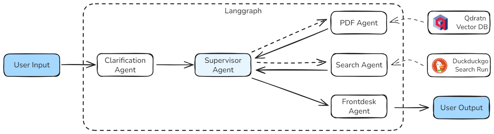

# AI Research Paper Chatbot
<p align="center">
  <a href="https://www.python.org/"></a>
  <a href="https://qdrant.tech/"></a>
  <a href="https://github.com/langchain-ai/langgraph"></a>
  <a href="https://hub.docker.com/"></a>
  <a href="https://fastapi.tiangolo.com/"></a>
  <a href="#license"></a>
</p>


A sophisticated multi-agent chatbot system built with LangGraph, FastAPI, and Qdrant Cloud for intelligent research paper analysis and question answering.

## Architecture Overview

This chatbot implements a multi-agent architecture using LangGraph, where specialized agents work together to process user queries about research papers. The system combines PDF document retrieval, web search capabilities, and intelligent routing to provide comprehensive answers.

### Architecture Diagram

<p align="center">
  
</p>

### Agent Descriptions

| Agent | Purpose | Responsibilities |
|-------|---------|------------------|
| **Clarification Agent** | Query Enhancement | Analyzes and expands user queries for better retrieval |
| **Supervisor Agent** | Orchestration | Routes queries to appropriate specialized agents |
| **PDF Agent** | Document Retrieval | Searches and retrieves relevant information from PDF documents |
| **Search Agent** | Web Search | Performs web searches for additional information |
| **Frontdesk Agent** | Response Formatting | Formats and presents final responses to users |

## Project Structure

```
chatbot/
├── main.py                    # FastAPI application entry point
├── dockerfile                 # Docker container configuration
├── docker-compose.yaml        lo# Multi-service orchestration
├── requirements.txt           # Python dependencies
├── env.example               # Environment variables template
├── graph.png                 # Architecture diagram
├── README.md                 # This file
│
├── server/
│   ├── routes/                  # FastAPI route handlers
│   │   ├── default.py           # Health check endpoint
│   │   ├── langgraph.py         # LangGraph chat endpoints
│   │   └── qdrant.py            # Qdrant vector database endpoints
│   │
│   ├── schema/                  # Pydantic data models
│   │   ├── langgraph.py         # Chat request/response schemas
│   │   └── qdrant.py            # Qdrant operation schemas
│   │
│   ├── service/                 # External service integrations
│   │   ├── llm_svc.py           # OpenAI GPT service configuration
│   │   └── qdrant_svc.py        # Qdrant Cloud client configuration
│   │
│   ├── src/                     # Core application logic
│   │   ├── agent/               # LangGraph agent definitions
│   │   │   ├── agent.py         # Main graph builder
│   │   │   └── handoff.py       # Agent routing logic
│   │   │
│   │   ├── node/                # Individual agent implementations
│   │   │   ├── clarification_node.py
│   │   │   ├── supervisor_node.py
│   │   │   ├── pdf_node.py
│   │   │   ├── search_node.py
│   │   │   └── front_node.py
│   │   │
│   │   └── systemmessage.py     # Agent prompt templates
│   │
│   └── utils/                   # Utility modules
│       ├── state.py             # Application state management
│       └── qdrant/              # Qdrant operations
│           ├── qdrant_insert.py # Document ingestion
│           ├── qdrant_read.py   # Document retrieval
│           └── qdrant_remove.py # Document deletion
│
└── resource/                    # PDF documents for processing
    └── papers/                  # Research paper collection
```

## How to Run Locally

### Prerequisites

- Docker and Docker Compose installed
- OpenAI API key
- Qdrant Cloud account and API key

### Quick Start

1. **Clone and Setup**
   ```bash
   git clone <repository-url>
   cd chatbot
   cp env.example .env
   ```

2. **Configure Environment Variables**
   ```bash
   # Edit .env file with your credentials
   QDRANT_URL=https://your-cluster.your-region.qdrant.cloud:6333
   QDRANT_API_KEY=your-qdrant-cloud-api-key
   COLLECTION_NAME=papers
   MODEL=gpt-3.5-turbo
   MODEL_E=text-embedding-3-small
   API_KEY=your-openai-api-key-here
   BASE_URL=https://api.openai.com/v1
   ```

3. **Run with Docker Compose**
   ```bash
   docker-compose up --build
   ```

4. **Test the API**
   ```bash
   # Health check
   curl http://localhost:8080/health
   
   # Chat with the bot
   curl -X POST http://localhost:8080/langgraph/chatmessage \
     -H "Content-Type: application/json" \
     -d '{"prompt": "What are the main findings in the research papers?", "thread_id": "test-thread"}'
   ```

## Ingesting PDFs into Qdrant (Cloud)

This project stores embeddings in Qdrant Cloud. To ingest PDFs:

1) Ensure the files are available INSIDE the container.

- The application runs with working directory `/opt/app`.
- If you mount a volume for `resource/`, the canonical path becomes:
  - A single file: `/opt/app/resource/task.pdf`
  - A directory of PDFs: `/opt/app/resource/papers`

2) Call the ingest endpoint with that absolute path:

```bash
curl -X POST http://localhost:8080/qdrant/data \
  -H "Content-Type: application/json" \
  -d '{"dir": "/opt/app/resource/task.pdf"}'
```

or for a directory:

```bash
curl -X POST http://localhost:8080/qdrant/data \
  -H "Content-Type: application/json" \
  -d '{"dir": "/opt/app/resource/papers"}'
```

3) List or clear data:

```bash
curl http://localhost:8080/qdrant/data?limit=25
curl -X DELETE http://localhost:8080/qdrant/data -H "Content-Type: application/json" -d '{"id":"<POINT_ID>"}'
curl -X DELETE http://localhost:8080/qdrant/data/all
```

Notes:
- Ensure your `.env` has valid Qdrant Cloud URL and API key.
- Embedding model: `MODEL_E` (default `text-embedding-3-small`).
- Collection name comes from `COLLECTION_NAME`.

### Using Uploaded Docker Image
You also can simpely using the image that have been build on, by makesure you have the all the cridential as the .env above
```bash
# pull image
docker pull ghcr.io/raffelprama/paper-chatbot:0.0.1

# run image
docker run --env-file .env -p 5001:5001 ghcr.io/raffelprama/paper-chatbot:0.0.1
```
    
## API Documentation

### LangGraph Endpoints

| Method | Endpoint | Description | Input Parameters | Tags |
|--------|----------|-------------|------------------|------|
| `POST` | `/langgraph/chatmessage` | Chat with the AI agent | `prompt: str`, `thread_id: Optional[str]` | `langgraph` |
| `DELETE` | `/langgraph/memory` | Clear conversation memory | None | `langgraph` |

### Qdrant Endpoints

| Method | Endpoint | Description | Input Parameters | Tags |
|--------|----------|-------------|------------------|------|
| `POST` | `/qdrant/data` | Ingest PDF documents | `dir: str` (path to PDFs) | `qdrant` |
| `GET` | `/qdrant/data` | List stored documents | `limit: int` (default: 50) | `qdrant` |
| `DELETE` | `/qdrant/data` | Delete document by ID | `id: str` | `qdrant` |
| `DELETE` | `/qdrant/data/all` | Clear all documents | None | `qdrant` |

### Default Endpoints

| Method | Endpoint | Description | Input Parameters | Tags |
|--------|----------|-------------|------------------|------|
| `GET` | `/health` | Health check | None | `default` |

## How It Works

### 1. Query Processing Flow

1. **User Input**: User submits a question via the `/langgraph/chatmessage` endpoint
2. **Clarification**: The clarification agent enhances and expands the query
3. **Supervision**: The supervisor agent analyzes the query and routes it to appropriate agents
4. **Processing**: Specialized agents (PDF, Search, or Front) handle the query
5. **Response**: The front agent formats and returns the final answer

### 2. Document Retrieval

- PDF documents are processed and chunked using `RecursiveCharacterTextSplitter`
- Text chunks are embedded using OpenAI's embedding models
- Vectors are stored in Qdrant Cloud for efficient similarity search
- Retrieval uses semantic search to find relevant document sections

### 3. Multi-Agent Coordination

- **LangGraph** manages the agent workflow and state
- **InMemorySaver** maintains conversation context
- **Conditional routing** ensures queries reach the most appropriate agent
- **Fallback mechanisms** handle errors gracefully

## Technology Stack

- **Framework**: FastAPI + Uvicorn
- **AI/ML**: LangGraph, LangChain, OpenAI GPT
- **Vector Database**: Qdrant Cloud
- **Document Processing**: PyPDF, LangChain Text Splitters
- **Web Search**: DuckDuckGo Search
- **Containerization**: Docker + Docker Compose

## Future Improvements

### Short Term (1-3 months)
- **Enhanced Error Handling**: Implement comprehensive error recovery and user-friendly error messages
- **Response Streaming**: Add real-time response streaming for better user experience
- **Document Management**: Implement document versioning and update mechanisms
- **Performance Optimization**: Add caching layers and optimize vector search performance

### Medium Term (3-6 months)
- **Multi-Modal Support**: Extend to handle images, tables, and other document formats
- **Advanced RAG**: Implement hybrid search combining semantic and keyword search
- **User Authentication**: Add user management and conversation history persistence
- **Analytics Dashboard**: Build monitoring and analytics for usage patterns

### Long Term (6+ months)
- **Fine-Tuned Models**: Train custom models on domain-specific research papers
- **Multi-Language Support**: Extend to support multiple languages
- **API Rate Limiting**: Implement sophisticated rate limiting and usage quotas
- **Distributed Architecture**: Scale to handle multiple concurrent users and large document collections

## Performance Considerations

- **Vector Search**: Optimized similarity search using Qdrant's efficient indexing
- **Memory Management**: InMemorySaver provides fast conversation context
- **Async Processing**: Full async/await support for high concurrency
- **Docker Optimization**: Multi-stage builds and dependency caching

## Security Features

- **Environment Variables**: Sensitive data stored in environment variables
- **API Key Management**: Secure handling of OpenAI and Qdrant API keys
- **Input Validation**: Pydantic schemas ensure data integrity
- **Error Sanitization**: Prevents sensitive information leakage in error messages

## License

This project is licensed under the MIT License - see the [LICENSE](LICENSE) file for details.

## Contributing

1. Fork the repository
2. Create a feature branch (`git checkout -b feature/amazing-feature`)
3. Commit your changes (`git commit -m 'Add some amazing feature'`)
4. Push to the branch (`git push origin feature/amazing-feature`)
5. Open a Pull Request

## Support

For support and questions, please open an issue in the GitHub repository or contact the owner.

---
